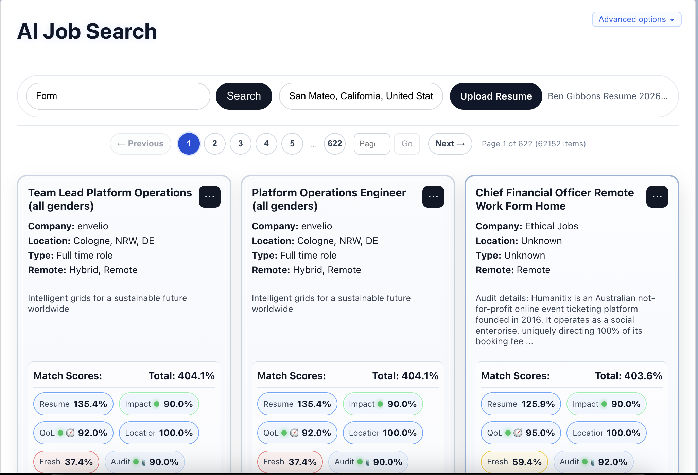

# AI Job Search

AI Job Search aggregates jobs from a broad set of public job boards and ranks them against a search query, location, uploaded resume, job freshness, employer impact, quality of life, and audit signals. The application combines a React client with an Express and Socket.IO server, keeping searches and AI enrichment responsive as results arrive.



## Features

- Search across cached listings collected from general, remote, nonprofit, climate, healthcare, public-sector, and employer-hosted job boards.
- Upload PDF, DOCX, or text resumes and rank jobs by resume relevance.
- Filter by location and include remote opportunities.
- Tune the weight of resume, impact, quality-of-life, location, freshness, and employer-audit scores.
- Inspect score distributions and AI coverage for the current result set.
- Run AI employer audits and enrichment across a search.
- Add jobs manually, hide jobs or companies, and rate jobs and employers.
- Keep private notes, activity statistics, and search preferences in browser storage.
- Export and import locally stored user data as XML.
- Browse large result sets with server-side pagination and search suggestions.

## Tech Stack

- **Client:** React 19, TypeScript, Vite, Socket.IO Client, PDF.js, Mammoth, and Three.js
- **Server:** Node.js, TypeScript, Express 5, Socket.IO, and Gemini
- **Data:** JSON-backed scraper caches with optional persistent volume storage
- **Deployment:** Multi-stage Docker image and Fly.io configuration

## Requirements

- Node.js 20 or newer
- npm
- A Gemini API key for AI-powered audits and enrichment
- Optional API keys for additional job and geocoding providers

## Local Development

Install dependencies from the repository root:

```bash
npm install
npm install --prefix client
npm install --prefix server
```

Create the server environment file:

```bash
cp server/.env.example server/.env
```

At minimum, set `GEMINI_API_KEY` in `server/.env` if you want AI features. The application can use its checked-in caches without configuring every external provider.

Start the client and server together:

```bash
npm run dev
```

The client runs at [http://localhost:3010](http://localhost:3010), and the server runs at [http://localhost:4000](http://localhost:4000).

For a faster cache-only startup that avoids refreshing scraper sources:

```bash
npm run quickDev
```

The root development scripts stop existing processes on ports `3010` and `4000` before launching both services.

## Configuration

Configuration lives in `server/.env`. See [`server/.env.example`](server/.env.example) for the full set of supported variables.

Common settings include:

| Variable | Purpose |
| --- | --- |
| `PORT` | Socket.IO and Express server port; defaults to `4000` locally. |
| `CLIENT_ORIGIN` | Allowed browser origin; defaults to `http://localhost:3010`. |
| `GEMINI_API_KEY` | Enables Gemini-backed employer audits and enrichment. |
| `GEOAPIFY_API_KEY` / `MAPQUEST_API_KEY` | Enable additional location and geocoding strategies. |
| `CACHE_SEED_MODE` | Controls mounted-cache seeding: `overwrite`, `missing`, or `off`. |
| `AUDIT_ALL_MAX_CONCURRENCY` | Limits concurrent AI enrichment work. |
| `AUDIT_ALL_MAX_JOBS` | Caps the number of jobs processed by an audit-all request. |
| `ASHBY_ORGS`, `GREENHOUSE_BOARDS`, `LEVER_BOARDS` | Override the built-in employer board packs. |

Provider-specific variables are available for Adzuna, Jooble, Reed, USAJobs, Indeed RSS, Craigslist RSS, Climatebase, Escape the City, and 80,000 Hours. Empty optional provider values simply leave those integrations unavailable or using their built-in defaults.

To point the client at a server other than `http://localhost:4000`, set `VITE_SERVER_URL` when building or running the client. In production, the client defaults to the same origin.

## How It Works

1. The server loads and normalizes job listings from scraper caches and configured sources.
2. The client sends the current query, resume text, location, filters, score weights, ratings, and pagination range over Socket.IO.
3. The server filters and scores matching jobs, then returns ranked wrappers with score metadata.
4. Optional AI tasks enrich employers with audit, impact, and quality-of-life signals and stream updates back to the client.
5. User-created jobs, notes, ratings, hidden items, and preferences remain in browser storage unless explicitly exported.

## Project Structure

```text
.
├── client/                 React and Vite application
│   └── src/                Search UI, ranking controls, notes, and resume parsing
├── server/
│   ├── cache/              Cached scraper output
│   └── src/
│       ├── llms/           Gemini requests and response caching
│       ├── resume/         Resume-related server models
│       ├── scraping/       Source adapters and cache orchestration
│       ├── searching/      Filtering, scoring, ranking, and AI audits
│       └── utils/          Geocoding, rate limits, and background work
├── Dockerfile              Production client/server image
├── fly.toml                Fly.io application configuration
└── DEPLOY_FLY.md           Detailed Fly.io deployment guide
```

## Build and Test

Build each application independently:

```bash
npm run build --prefix client
npm run build --prefix server
```

Run the server test suite:

```bash
npm test --prefix server
```

Lint the client:

```bash
npm run lint --prefix client
```

## Docker

The production image builds both applications and serves the Vite bundle from the Express server:

```bash
docker build -t ai-job-search .
docker run --rm -p 8080:8080 \
	--env-file server/.env \
	ai-job-search
```

Open [http://localhost:8080](http://localhost:8080). The image seeds `/app/server/cache` from the bundled cache snapshot when it starts.

## Deploying to Fly.io

The repository includes a single-app Fly.io deployment with a persistent cache volume. See [`DEPLOY_FLY.md`](DEPLOY_FLY.md) for app creation, secrets, volume setup, deployment, and verification steps.

## Data and Privacy

Resume text is sent to the server as part of search requests so resume relevance can be calculated. Notes, ratings, hidden jobs, user-created jobs, and preferences are stored locally in the browser. Review your deployment and AI-provider policies before using sensitive personal information.

Job data remains subject to the availability and terms of its original sources. Scrapers and upstream APIs may change independently of this project.

## License

This project is available under the terms in [`LICENSE`](LICENSE).